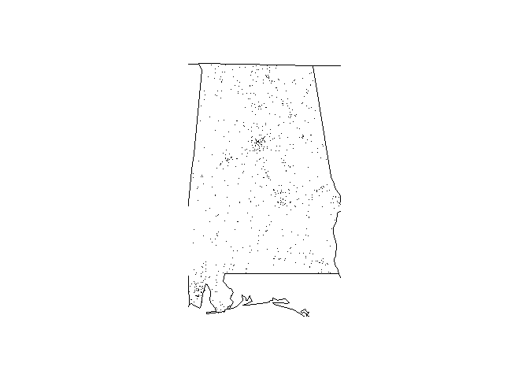

<!-- README.md is generated from README.Rmd. Please edit that file -->

# fatalcaranalysiisreports

<!-- badges: start -->

<https://travis-ci.org/gben1750/fatal-car-analysis-reporting-system.svg?branch=main>
<!-- badges: end -->

The goal of the Fatal Car Analysis package is to graphically display the
location of fatal car accidents for a given year and state. Data sets
for the years 2013-2015 are available in the package.

## Installation

You can install the released version of fatalcaranalysiisreports from
[CRAN](https://CRAN.R-project.org) with:

``` r
install.packages("fatalcaranalysiisreports")
```

And the development version from [GitHub](https://github.com/) with:

``` r
# install.packages("devtools")
devtools::install_github("gben1750/fatal-car-analysis-reporting-system")
```

## Example

This is a basic example which demonstrates how to display the location
of fatal accidents for a selected year and state.

The following R code will display the location of accidents for Alabama
during 2014.

``` r
library(fatalcaranalysiisreports)
fars_map_state(1, 2014)
```


